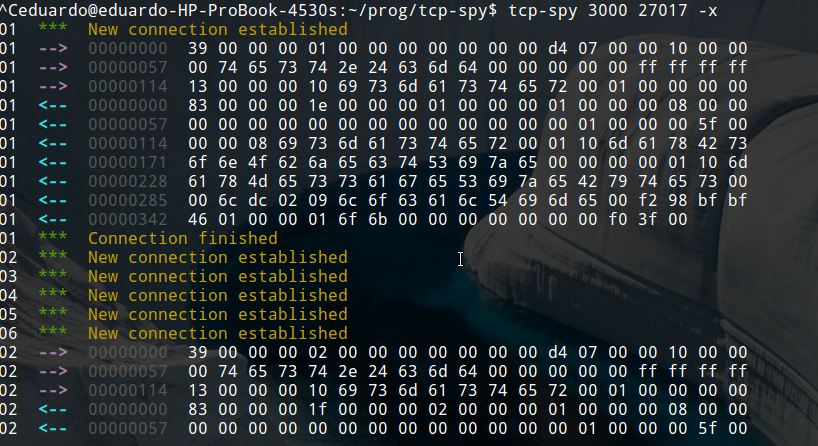

tcp spy
=======

[](http://travis-ci.org/sorribas/tcp-spy)

TCP Proxy server for debugging purposes.

Install
-------

```
npm install tcp-spy
```

Or if you're going to use the command line tool

```
npm install tcp-spy -g
```

CLI
---

You can run the command line interface like this.

```
USAGE:

tcp-spy PORT [FORWARD_HOST:]FORWARD_PORT [OPTIONS]

Options: -x || --hex Hexadecimal output
```

example

```
tcp-spy 3000 localhost:25
```

screenshots
-----------

HTTP example


Example with the hex option



module
------

You can also use tcp-spy as a node module like this.

```js
var tcpSpy = require('tcp-spy');
var spy = tcpSpy({
  port: 3000, 
  forwardHost: 'localhost', // optional, defaults to localhost
  forwardPort: 25
});

spy.on('connection', function(client, server) {
  client.pipe(process.stdout);
  server.pipe(process.stdout);
});
```

License
-------

MIT License

Copyright 2014 Eduardo Sorribas
http://sorribas.org

Permission is hereby granted, free of charge, to any person obtaining
a copy of this software and associated documentation files (the
"Software"), to deal in the Software without restriction, including
without limitation the rights to use, copy, modify, merge, publish,
distribute, sublicense, and/or sell copies of the Software, and to
permit persons to whom the Software is furnished to do so, subject to
the following conditions:

The above copyright notice and this permission notice shall be
included in all copies or substantial portions of the Software.

THE SOFTWARE IS PROVIDED "AS IS", WITHOUT WARRANTY OF ANY KIND,
EXPRESS OR IMPLIED, INCLUDING BUT NOT LIMITED TO THE WARRANTIES OF
MERCHANTABILITY, FITNESS FOR A PARTICULAR PURPOSE AND
NONINFRINGEMENT. IN NO EVENT SHALL THE AUTHORS OR COPYRIGHT HOLDERS BE
LIABLE FOR ANY CLAIM, DAMAGES OR OTHER LIABILITY, WHETHER IN AN ACTION
OF CONTRACT, TORT OR OTHERWISE, ARISING FROM, OUT OF OR IN CONNECTION
WITH THE SOFTWARE OR THE USE OR OTHER DEALINGS IN THE SOFTWARE.
